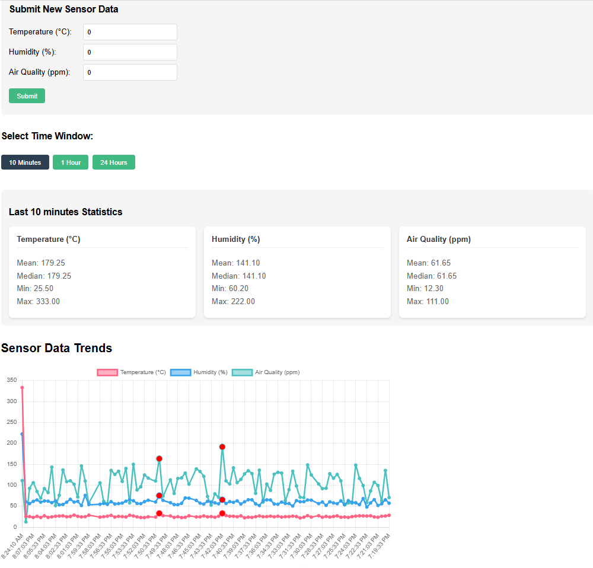

# IoT Data Processing Backend Service

**Backend:** FastAPI | **Database:** Postgres | **Frontend:** Vue 3 + TypeScript

## Overview

A backend service that ingests, cleans, and aggregates IoT sensor data (temperature, humidity, air quality) with anomaly detection. Includes a basic frontend dashboard for visualization.

---

## Setup Instructions

### Prerequisites

- **Python** 3.9+
- **Node.js** 16+ (for frontend)
- **Docker** (optional)

### 1. Backend Setup

```bash
cd backend
pip install -r requirements.txt  # Install dependencies
uvicorn main:app --reload        # Start FastAPI server (http://localhost:8000)
```

### 2. Database Setup

- SQLite is used by default (auto-created at `backend/sensor_data.db`).
- To switch to PostgreSQL/MySQL, update `database.py`.

### 3. Frontend Setup

```bash
cd frontend
npm install          # Install dependencies
npm run dev          # Start dev server (http://localhost:5173)
```

### Docker (Alternative)

```bash
docker-compose up --build  # Starts both backend + frontend
```

**Access:**

- **Backend:** [http://localhost:8000](http://localhost:8000)
- **Frontend:** [http://localhost:5173](http://localhost:5173)

---

## API Endpoints

| Endpoint             | Method | Description                      | Example Request |
| -------------------- | ------ | -------------------------------- | --------------- |
| `/sensor/data`       | POST   | Ingests sensor data              | See below       |
| `/sensor/processed`  | GET    | Returns cleaned data + anomalies | See below       |
| `/sensor/aggregated` | GET    | Returns aggregated stats         | See below       |

### Examples

#### POST `/sensor/data`

**Request:**

```json
{
  "temperature": 25.5,
  "humidity": 60.2,
  "air_quality": 120,
  "timestamp": "2024-05-01T12:00:00Z"
}
```

**Response:**

```json
{ "status": "success", "message": "Data ingested" }
```

#### GET `/sensor/processed`

**Query Params:**

- `time_window=10m` (last 10 minutes)
- `sensor_type=temperature`

**Response:**

```json
{
  "data": [
    {
      "timestamp": "2024-05-01T12:00:00Z",
      "temperature": 25.5,
      "is_anomaly": false
    }
  ]
}
```

#### GET `/sensor/aggregated`

**Query Params:**

- `time_window=1h`
- `aggregation=mean,min,max`

**Response:**

```json
{
  "temperature": { "mean": 26.1, "min": 24.5, "max": 28.0 },
  "humidity": { "mean": 58.3, "min": 55.0, "max": 62.1 }
}
```

---

## Data Processing Approach

### Data Cleaning

- Removed duplicates using timestamp-based deduplication.
- Filled missing values using linear interpolation for numerical fields.

### Anomaly Detection

- Applied Z-score (threshold=3) to flag outliers in sensor readings.
- Anomalies are excluded from aggregates but returned in `/processed` for visualization.

---

## Frontend Dashboard

- Displays time-series charts (using Chart.js).
- Highlights anomalies in red.
- Supports dynamic time-window filters (e.g., "Last 1 hour").

---

## Dashboard Preview



---

## API Documentation

For detailed API documentation and testing, visit the [Postman Documentation](https://documenter.getpostman.com/view/29494935/2sB2cUBiJv).
